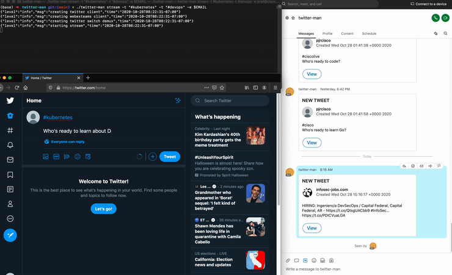

<!-- [![Contributors][contributors-shield]][contributors-url]
[![Forks][forks-shield]][forks-url]
[![Stargazers][stars-shield]][stars-url]
[![Issues][issues-shield]][issues-url]
 -->

<!-- TABLE OF CONTENTS -->
## Table of Contents

* [About the Project](#about-the-project)
  * [Built With](#built-with)
* [Getting Started](#getting-started)
  * [Prerequisites](#prerequisites)
  * [Installation](#installation)
* [Usage](#usage)
* [Roadmap](#roadmap)
* [Contributing](#contributing)
* [License](#license)
* [Contact](#contact)
* [Acknowledgements](#acknowledgements)


<!-- ABOUT THE PROJECT -->
## About The Project



A Go cli tool that streams tweets from Twitter to Webex Teams via adaptivecards. 

Here's why:
* To demonstrate concurrency in Go
* Explore community Go libraries 
* Explore the Twitter API and Webex Teams API

### Built With
* [Go](https://golang.org/)
* [Webex Teams](https://developer.webex.com/)
* [Twitter](https://developer.twitter.com/)
* [Cobra](https://github.com/spf13/cobra)
* [Logrus](https://github.com/sirupsen/logrus)
* [go-twitter](https://github.com/dghubble/go-twitter)

## Getting Started

### Prerequisites

* Go installed (https://golang.org/doc/install)
* A Webex Teams Bot Access Token (https://developer.webex.com)
* Twitter Developer Account + Project with Read Only permissions (https://developer.twitter.com) 

### Installation
Secrets are passed into the cli application through environment variables. The following environment variables are required to run this application.
```bash
# Twitter environment variables
TWITTER_CONSUMER_KEY
TWITTER_CONSUMER_SECRET
TWITTER_ACCESS_TOKEN
TWITTER_ACCESS_SECRET

# Webex Teams environment variables
WEBEXTEAMS_TOKEN
```

1. Clone the repo
```sh
git clone https://github.com/patrickcisco/twitter-man
```
2. Build from source
```sh
go build -o twitter-man main.go
```
3. Run the ```twitter-man``` binary
```sh
./twitter-man --help
```


<!-- USAGE EXAMPLES -->
## Usage

```
twitter-man --help
A cli application that streams tweets from Twitter

Usage:
  twitter-man [command]

Available Commands:
  help        Help about any command
  stream      Begin streaming twitter tweets

Flags:
      --config string   config file (default is $HOME/.twitter-man.yaml)
  -h, --help            help for twitter-man
      --log string      log level (default "info")

Use "twitter-man [command] --help" for more information about a command.


twitter-man stream --tag "#ciscolive" --tag "#ciscodevnet" --to_person_email "nobody@cisco.com"
```

<!-- CONTRIBUTING -->
## Contributing
1. Fork the Project
2. Create your Feature Branch
3. Commit your Changes
4. Push to the Branch
5. Open a Pull Request